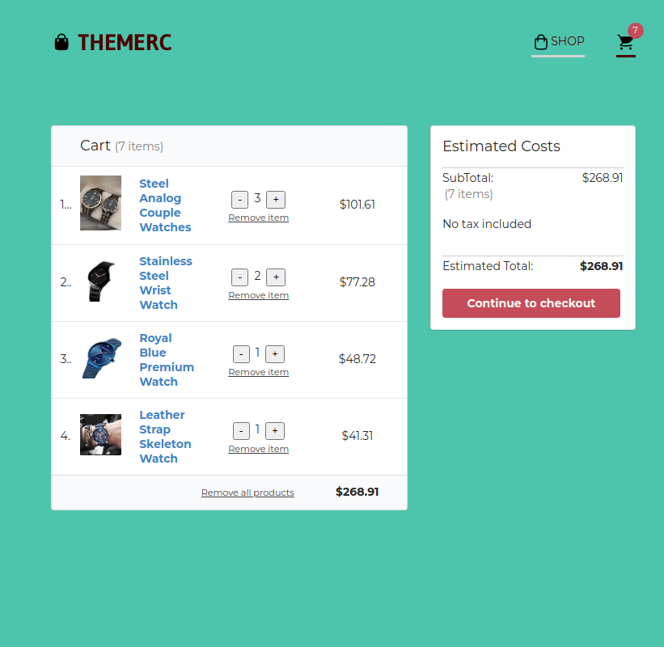

# Dummy E-Commerce
An application that primarily operate as e-commerce website made with React(Hooks). It includes shop, individual products, and cart page.

Click [here](https://dapper-pastelito-04ff24.netlify.app) to access live demo.

## APIs
- [DummyJSON - Fake REST API of JSON data for development](https://dummyjson.com/)

### Dependencies used
- React Flip Move
- Styled Components
- React Testing Libraries
- React Lazy Load Image Component
- Semantic UI React

### Preview

### Credits
- Image by [Hugo Hercer](https://pixabay.com/es/users/loginueve_ilustra-12954610/?utm_source=link-attribution&amp;utm_medium=referral&amp;utm_campaign=image&amp;utm_content=5217035) at [Pixabay](https://pixabay.com/es/?utm_source=link-attribution&amp;utm_medium=referral&amp;utm_campaign=image&amp;utm_content=5217035)

- Image by [Fritz Straub](https://pixabay.com/es/users/fstraub812-703905/?utm_source=link-attribution&amp;utm_medium=referral&amp;utm_campaign=image&amp;utm_content=1001596") at [Pixabay](https://pixabay.com/es/?utm_source=link-attribution&amp;utm_medium=referral&amp;utm_campaign=image&amp;utm_content=1001596)
